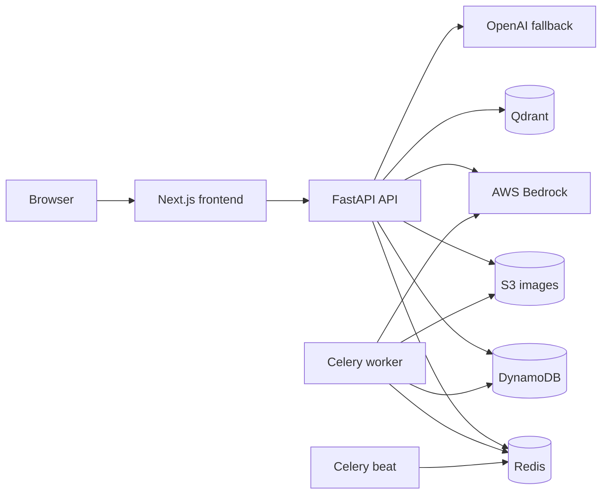

# Tech News Mystery

Tech News Mystery is a full-stack technology news platform for discovering,
searching, processing, reading, saving, and discussing AI/tech articles. The
app uses a Next.js frontend, FastAPI backend, DynamoDB persistence, S3 image
storage, Redis/Celery background processing, Qdrant semantic search, and
LLM-powered article enrichment.

## Quick Links

| Area | Link |
| --- | --- |
| API reference | [docs/API_REFERENCE.md](docs/API_REFERENCE.md) |
| System architecture | [docs/ARCHITECTURE.md](docs/ARCHITECTURE.md) |
| Deployment architecture | [docs/DEPLOYMENT_ARCHITECTURE.md](docs/DEPLOYMENT_ARCHITECTURE.md) |
| GitHub CI/CD | [docs/GITHUB_CICD.md](docs/GITHUB_CICD.md) |
| Terraform stack | [infra/terraform/README.md](infra/terraform/README.md) |

Production app endpoint:

```text
http://tech-news-mystery-prod-alb-840627461.us-west-2.elb.amazonaws.com
```

## Features

- Article listing, detail pages, search, saves, likes, comments, and profiles
- Admin-only article creation, queue review, web/news search triggers, and user role management
- Hybrid semantic/keyword search backed by Qdrant
- AI-assisted extraction, summarization, category classification, and metadata generation
- Background workers for scheduled discovery and article processing
- Apple-inspired glass UI with responsive top navigation
- AWS production deployment through ECS Fargate, ALB, ECR, DynamoDB, S3, ElastiCache, Secrets Manager, and Bedrock

## Stack

| Layer | Technology |
| --- | --- |
| Frontend | Next.js 14, React 18, TypeScript, Tailwind CSS, Zustand, TanStack Query |
| Backend | FastAPI, Python 3.11, PynamoDB, Celery |
| Data | DynamoDB, S3, Qdrant |
| Async/cache | Redis locally, ElastiCache Redis in AWS |
| AI/search | AWS Bedrock, OpenAI fallback, Tavily, NewsAPI |
| Deployment | Docker, ECR, ECS Fargate, ALB, Terraform, GitHub Actions |

<details>
<summary>System Architecture</summary>



Production runs four ECS services:

| Service | Purpose |
| --- | --- |
| `frontend` | Serves the Next.js production UI |
| `api` | Serves FastAPI HTTP routes under `/v1` |
| `worker` | Runs Celery background jobs |
| `beat` | Runs Celery schedules |

More detail: [docs/ARCHITECTURE.md](docs/ARCHITECTURE.md).

</details>

<details>
<summary>Local Development</summary>

Start Redis:

```powershell
cd infra
docker compose up redis
```

Start backend:

```powershell
cd backend
pip install -r requirements.txt
uvicorn app.main:app --host 0.0.0.0 --port 8000 --reload
```

Start frontend:

```powershell
cd frontend
npm install
npm run dev
```

Local URLs:

| Service | URL |
| --- | --- |
| Frontend | `http://localhost:3000` |
| Backend | `http://localhost:8000` |
| Swagger | `http://localhost:8000/docs` |

</details>

<details>
<summary>Configuration</summary>

The backend reads runtime settings from environment variables through
`backend/app/config.py`.

Important settings:

| Variable | Purpose |
| --- | --- |
| `AWS_REGION` | AWS region, currently `us-west-2` |
| `DYNAMODB_TABLE_PREFIX` | DynamoDB table prefix, currently `tech-news-` |
| `S3_BUCKET` | Article image/object bucket |
| `REDIS_URL` | Cache Redis URL |
| `CELERY_BROKER_URL` | Celery broker Redis URL |
| `CELERY_RESULT_BACKEND` | Celery result Redis URL |
| `LLM_PROVIDER` | Ordered LLM providers, for example `bedrock,openai` |
| `BEDROCK_MODEL` | Bedrock model ID |
| `QDRANT_MODE` | `cloud` or `docker` |
| `QDRANT_URL` | Qdrant Cloud endpoint when using cloud mode |

Local manual mode commonly uses `localhost:6379`; Docker Compose uses
`redis://redis:6379`; AWS ECS uses the Terraform-created ElastiCache endpoint.

</details>

<details>
<summary>Deployment</summary>

Infrastructure is managed manually with Terraform in `infra/terraform`.
The Terraform workflow is intentionally parked as:

```text
.github/workflows/terraform.yml.bak
```

That means normal pushes do not redeploy infrastructure.

App CI/CD is handled by `.github/workflows/deploy.yml`:

- Pull requests run backend compile checks and frontend type-check/test/build.
- Pushes to `main` run the same checks, build backend/frontend Docker images,
  push them to ECR, and force a new ECS rollout.
- Only app code/container changes deploy automatically.

Current AWS production resources:

| Resource | Name |
| --- | --- |
| Region | `us-west-2` |
| ECS cluster | `tech-news-mystery-prod` |
| ALB | `tech-news-mystery-prod-alb-840627461.us-west-2.elb.amazonaws.com` |
| S3 article bucket | `tech-news-articles-381492273521` |
| ECR backend | `tech-news-mystery-prod-backend` |
| ECR frontend | `tech-news-mystery-prod-frontend` |
| Redis | `tech-news-mystery-prod-redis.jx9fd6.ng.0001.usw2.cache.amazonaws.com` |

More detail: [docs/DEPLOYMENT_ARCHITECTURE.md](docs/DEPLOYMENT_ARCHITECTURE.md)
and [docs/GITHUB_CICD.md](docs/GITHUB_CICD.md).

</details>

<details>
<summary>Useful Commands</summary>

Frontend checks:

```powershell
cd frontend
npm run type-check
npm test
npm run build
```

Backend checks:

```powershell
cd backend
python -m compileall app scripts
pytest
```

AWS service status:

```powershell
aws ecs describe-services --region us-west-2 --cluster tech-news-mystery-prod --services frontend api worker beat
aws logs tail /ecs/tech-news-mystery-prod --region us-west-2 --follow
```

</details>

## Repository Layout

| Path | Purpose |
| --- | --- |
| `backend/` | FastAPI app, Celery tasks, repositories, services |
| `frontend/` | Next.js application |
| `infra/docker/` | Production Dockerfiles |
| `infra/terraform/` | AWS infrastructure as code |
| `docs/` | Maintained project documentation |
| `.github/workflows/deploy.yml` | Active app CI/CD workflow |

## License

MIT. See [LICENSE](LICENSE).
