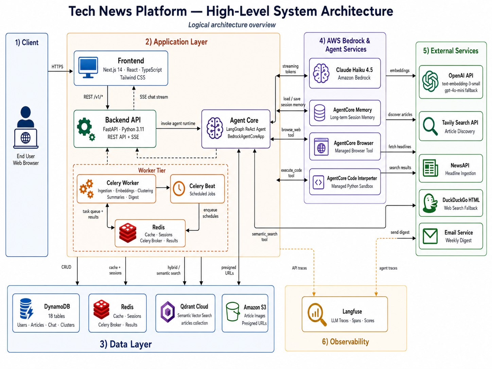
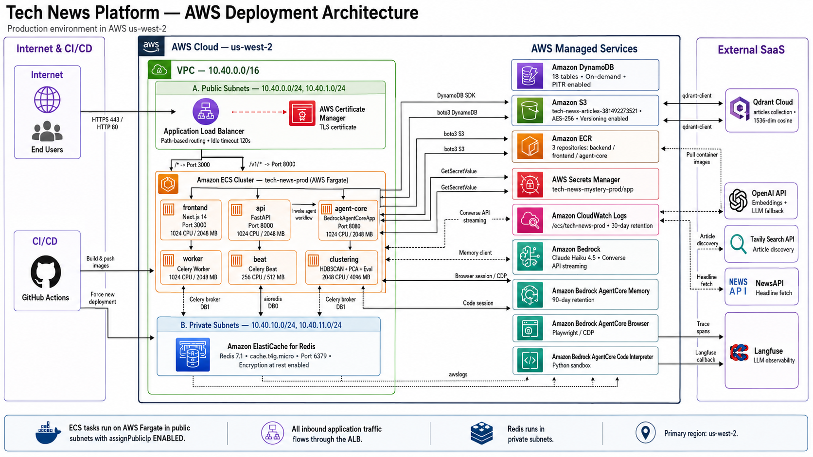

# Tech News Mystery

Tech News Mystery is an AI-powered technology news workspace. It collects articles, turns them into searchable knowledge, groups them into live topic clusters, and gives users a chat and voice agent for exploring what is happening across the tech landscape.

The README is intentionally product-first. For architecture, APIs, deployment, and operational details, start with the [documentation index](docs/README.md).

## What You Can Do

- Discover recent technology articles in a clean, searchable interface.
- Browse semantic topic clusters instead of scanning isolated article lists.
- See clustered articles as an interactive embedding map, with article nodes colored by topic.
- Drag, hover, and inspect article dots in a Neo4j-style topic view.
- Sort topics by size, recency, or diversity to understand what is broad, fresh, or varied.
- Retrigger clustering from the UI when new data should be regrouped.
- Ask the Agent questions about the article corpus and receive streamed chat responses.
- Test the dedicated voice agent with ElevenLabs STT/TTS, LiveKit room transport, and LangSmith voice telemetry.
- Interrupt the voice agent by pressing the interrupt control or by talking over playback.
- Keep chat and voice sessions separate so each testing mode has the right history.
- Use semantic search so related stories can be found even when keywords do not match exactly.
- Run background crawling, embedding, clustering, evaluation, summaries, and map preparation jobs.
- Operate the system locally or deploy it with the included cloud infrastructure.
- Use admin and health endpoints to inspect system behavior during development and production checks.

## Main Experiences

### Article Discovery

The Discover experience is the main entry point for browsing technology news. Users can search articles, inspect details, and move from individual stories into broader topics.

### Topics And Clustering

The Topics page groups articles by meaning, not by exact keyword. It shows the latest clustering set and provides a visual map where each dot represents an article. Dot color comes from the cluster assignment, and labels stay out of the way until the user hovers or selects a node.

The heavy map preparation work runs in background workers, so the UI can stay responsive while embeddings are projected into two dimensions.

Technical details: [Clustering Guide](docs/CLUSTERING_GUIDE.md) and [Clustering PCA Map](docs/CLUSTERING_PCA_MAP.md).

### Agent: Chat And Voice

The Agent experience has two modes. Chat mode keeps the existing streamed text assistant with persisted sessions, semantic retrieval, and web browsing fallback. Voice mode uses separate voice-test sessions, ElevenLabs Realtime Scribe STT with VAD commit strategy, a low-latency AgentCore voice path, ElevenLabs TTS playback, LiveKit room/session transport, and LangSmith telemetry events.

Voice mode is optimized for spoken answers: the agent uses a shorter one-paragraph prompt, avoids frontend text streaming, shows compact latency, and supports interruption during TTS. The current implementation uses a browser-side talk-over monitor for automatic barge-in; a full LiveKit Agent worker is documented as a future upgrade.

Technical details: [Chatbot Guide](docs/CHATBOT_GUIDE.md), [Agent Core](docs/AGENT_CORE.md), and [Voice Agent Implementation](docs/VOICE_AGENT_IMPLEMENTATION.md).

### Apple-Inspired Interface

The frontend uses a restrained Liquid Glass direction: translucent surfaces, soft borders, layered depth, compact controls, and responsive layouts that keep the product usable on desktop and smaller screens.

Design details: [Design System](docs/frontend/DESIGN_SYSTEM.md).

## Capabilities At A Glance

| Area | Capabilities |
| --- | --- |
| News ingestion | Crawl articles, extract readable content, store normalized article records. |
| Search | Keyword search, semantic search, and retrieval for chat/tooling flows. |
| Topics | Cluster articles, label topics, evaluate clustering quality, surface latest results. |
| Visualization | Worker-prepared PCA map, cluster-colored article nodes, hover/click inspection. |
| Agent chat | Streaming responses, persisted chat sessions, semantic article lookup, web browsing fallback, AgentCore integration. |
| Voice agent | Separate voice sessions, ElevenLabs Realtime Scribe STT, VAD turn commit, ElevenLabs TTS, LiveKit room transport, talk-over interruption, LangSmith telemetry. |
| Background work | Celery jobs for crawling, embedding, clustering, summaries, evaluations, and PCA maps. |
| Operations | Health checks, admin APIs, Terraform infrastructure, CI/CD configuration, local startup docs. |

## Quick Start

### Prerequisites

- Node.js 20+
- Python 3.11+
- Docker Desktop
- AWS credentials for cloud-backed development paths
- OpenAI API key for embedding generation
- Optional voice-agent credentials: ElevenLabs API key and voice ID, LiveKit URL/API key/API secret, and LangSmith API key

### Start Local Services

```powershell
cd infra
docker compose up redis agent-core
```

### Start Backend

```powershell
cd backend
pip install -r requirements.txt
uvicorn app.main:app --host 0.0.0.0 --port 8000 --reload
```

### Start Worker

```powershell
cd backend
celery -A app.workers.celery_app worker --loglevel=info
```

### Start Frontend

```powershell
cd frontend
npm install
npm run dev
```

## Local URLs

| Target | URL |
| --- | --- |
| Frontend | `http://localhost:3000` |
| Backend API | `http://localhost:8000` |
| Swagger UI | `http://localhost:8000/docs` |
| Agent Core health | `http://localhost:8080/health` |

For the full startup sequence, ports, and health checks, see [Manual Startup](docs/MANUAL_STARTUP.md).

## System Diagrams

<details>
<summary><b>High-Level System Architecture</b> — All services, data stores, and integrations</summary>



See full details in [System Architecture](docs/ARCHITECTURE.md).

</details>

<details>
<summary><b>Deployment Architecture</b> — AWS infrastructure, VPC, ECS, networking, and CI/CD</summary>



See full details in [Deployment Architecture](docs/DEPLOYMENT_ARCHITECTURE.md).

</details>

## Documentation

For architecture, APIs, deployment, and operational details, start with the [documentation index](docs/README.md).

### Architecture & Infrastructure

| Document | Summary |
| --- | --- |
| [System Architecture](docs/ARCHITECTURE.md) | All services, data stores, and external integrations. Includes Mermaid diagrams for the high-level component map, chat streaming sequence, article ingestion pipeline, clustering pipeline, and LLM fallback chain. |
| [Deployment Architecture](docs/DEPLOYMENT_ARCHITECTURE.md) | Full AWS infrastructure — VPC layout, ECS cluster, ALB, ElastiCache, DynamoDB, S3, Bedrock AgentCore, Secrets Manager, IAM roles, CI/CD pipeline, and local dev Docker Compose topology. All with Mermaid diagrams. |
| [CI/CD Configuration](docs/CI_CD_CONFIGURATION.md) | GitHub Actions workflows, ECR push, ECS rollout, Terraform pipeline, and required secrets. |

### Product Areas

| Document | Summary |
| --- | --- |
| [Chatbot Guide](docs/CHATBOT_GUIDE.md) | Chat sessions, streaming, Agent Core integration, persistence, and troubleshooting. |
| [Agent Core](docs/AGENT_CORE.md) | LangGraph agent runtime, tools, memory, prompts, streaming, and current scope. |
| [Voice Agent Implementation](docs/VOICE_AGENT_IMPLEMENTATION.md) | LiveKit + ElevenLabs STT/TTS voice path, VAD settings, LangSmith telemetry, voice UX, interruption handling, deployment env, and edge cases. |
| [Clustering Guide](docs/CLUSTERING_GUIDE.md) | Topic clustering, evaluations, worker flow, tables, and operations. |
| [Clustering PCA Map](docs/CLUSTERING_PCA_MAP.md) | Worker-backed article embedding projection and visualization behavior. |
| [API Reference](docs/API_REFERENCE.md) | HTTP endpoints and response schemas. |
| [Crawl4AI Guide](docs/CRAWL4AI_GUIDE.md) | Article crawling and content extraction. |
| [Frontend Design System](docs/frontend/DESIGN_SYSTEM.md) | Liquid Glass design language, tokens, and layout guidance. |

## Repository Layout

```text
agent_core/        Agent runtime service for chat and voice orchestration
backend/           FastAPI app, workers, repositories, services, tests
frontend/          Next.js app and UI components
infra/             Docker Compose and Terraform infrastructure
docs/              Durable architecture, product, operations, and frontend guides
scripts/           Operational helper scripts
```

## Developer Notes

- Browser warning `Extra attributes from the server: bis_skin_checked` is usually caused by a browser extension injecting attributes before React hydration. It is not generated by this codebase.
- The topic map does not invent relationship edges. It visualizes article embeddings as PCA-projected nodes colored by cluster.
- Heavy operations belong in workers. API routes should serve cached state, enqueue work, or stream lightweight events.
- Code Interpreter is currently parked, not deleted. The active AgentCore tool set is semantic search plus web browsing; code execution helpers remain in the codebase for a later restore.
- Voice credentials should live in `.env`, GitHub Actions secrets, or Secrets Manager. Do not commit raw ElevenLabs, LiveKit, LangSmith, Langfuse, or provider keys.

## License

See [LICENSE](LICENSE).
