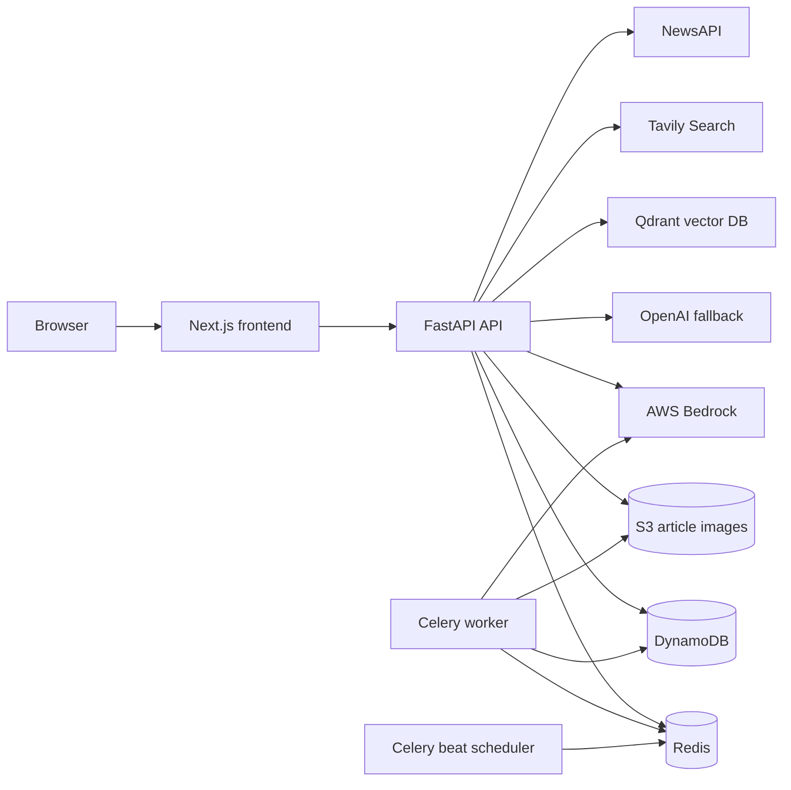
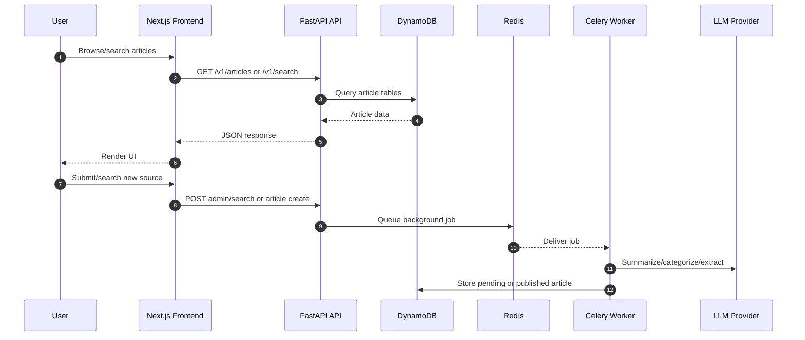
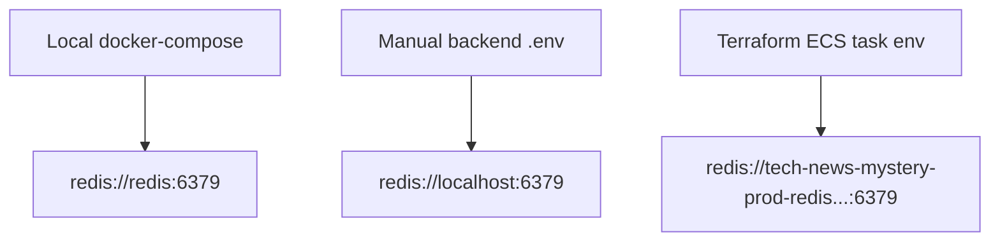

# System Architecture

Tech News Mystery is a full-stack news discovery platform. The frontend is a
Next.js app, the backend is FastAPI, persistent data lives in DynamoDB, async
work is handled by Celery, and AI processing uses AWS Bedrock with OpenAI as a
fallback.

## Runtime Components



## Request Flow



## Data Stores

| Store | Purpose |
| --- | --- |
| DynamoDB | Users, articles, comments, saves, likes, submissions, pending searches |
| S3 | Article image/object storage |
| Redis | Cache, Celery broker, Celery result backend |
| Qdrant | Vector search collection for article embeddings |

## DynamoDB Tables

```mermaid
erDiagram
  USERS {
    string user_id PK
    string username
    string role
  }
  ARTICLES {
    string article_id PK
    string slug
    string source_id
    number published_at
  }
  COMMENTS {
    string comment_id PK
    string article_id
    number created_at
  }
  USER_SAVES {
    string user_id PK
    string article_id SK
  }
  USER_LIKES {
    string user_id PK
    string article_id SK
  }
  USER_PREFERENCES {
    string user_id PK
  }
  NEWS_SOURCES {
    string source_id PK
  }
  TRENDING_ARTICLES {
    string trending_id PK
  }
  SUBMISSIONS {
    string submission_id PK
    string user_id
    number submitted_at
  }
  PENDING_SEARCHES {
    string search_id PK
    string status
  }

  USERS ||--o{ USER_SAVES : saves
  USERS ||--o{ USER_LIKES : likes
  USERS ||--o{ COMMENTS : writes
  ARTICLES ||--o{ COMMENTS : receives
  ARTICLES ||--o{ USER_SAVES : saved_as
  ARTICLES ||--o{ USER_LIKES : liked_as
```

## Why Four ECS Services?

The deployed ECS services map directly to separate runtime responsibilities:

| ECS service | Command | Why it exists |
| --- | --- | --- |
| `frontend` | `npm run start` | Serves the Next.js production UI |
| `api` | `uvicorn app.main:app` | Serves synchronous HTTP API requests |
| `worker` | `celery -A app.workers.celery_app worker` | Executes crawl/search/AI/background jobs |
| `beat` | `celery -A app.workers.celery_app beat` | Schedules recurring Celery tasks |

`worker` and `beat` are separate so the scheduler remains singleton-like while
workers can scale independently.

## Redis Resolution

Local and production use the same settings names, but different values:



The application reads `REDIS_URL`, `CELERY_BROKER_URL`, and
`CELERY_RESULT_BACKEND` from environment variables through `backend/app/config.py`.

## Pagination Strategy

The system uses a hybrid pagination approach optimized for both performance and UX:

### Server-Side Cursor Pagination
- **Purpose:** Efficient traversal of large datasets without offset
- **Implementation:** DynamoDB scan/query with `last_evaluated_key`
- **Fields:**
  - `limit`: Batch size (default 20, max 100)
  - `next_cursor`: Cursor for fetching next page (serialized last_evaluated_key)
  - `has_next`: Boolean indicating if more pages exist

### Total Count for UI Pagination
- **Purpose:** Display "Page X of Y" and smart pagination buttons
- **Implementation:** `ArticleRepository.count_all()` and `count_by_source()` methods
- **Optimization:** Uses DynamoDB `Select='COUNT'` parameter
  - Counts matching items without fetching full objects
  - ~10x faster than fetching all items (1000+ articles)
  - 90% less bandwidth usage
- **Caching:** Counts respect filters (category, published_only, quality_score)

### Frontend Display
- **Total pages calculated:** `totalPages = Math.ceil(total_count / itemsPerPage)`
- **Smart pagination display:** Shows first 2 pages + current area + last 2 pages
  - Example: `1 2 ... 49 50 51 ... 99 100` with ellipsis for gaps
  - Reduces button count from 100+ down to ~7-9 max
- **Client-side sorting:** Articles are sorted in JavaScript after fetching
- **Fetch limit:** Default 100 articles per request for responsive UX

### Example Flow
1. Frontend requests: `GET /articles?limit=100&category=AI`
2. Backend returns: 100 articles + `total_count=245` + `next_cursor`
3. Frontend calculates: `totalPages = ceil(245/12) = 21 pages`
4. Frontend displays: Smart pagination "1 2 ... 10 11 12 ... 20 21"
5. User clicks page 5: Display articles 48-60 from fetched batch (client-side)
6. User clicks "Next 100": Use `next_cursor` to fetch articles 101-200 from backend

### Trade-offs
| Aspect | Choice | Reason |
|--------|--------|--------|
| Cursor vs Offset | Cursor-based | Scales to millions of items, stable during concurrent changes |
| Fetch 100 vs 50 | 100 | Covers ~8 pages at 12 items/page, reduces backend calls |
| Total count calculation | DynamoDB SELECT | Instant count, no full item loading |
| Display all pages | Smart ellipsis | Scales to 1000+ pages without UI clutter |
