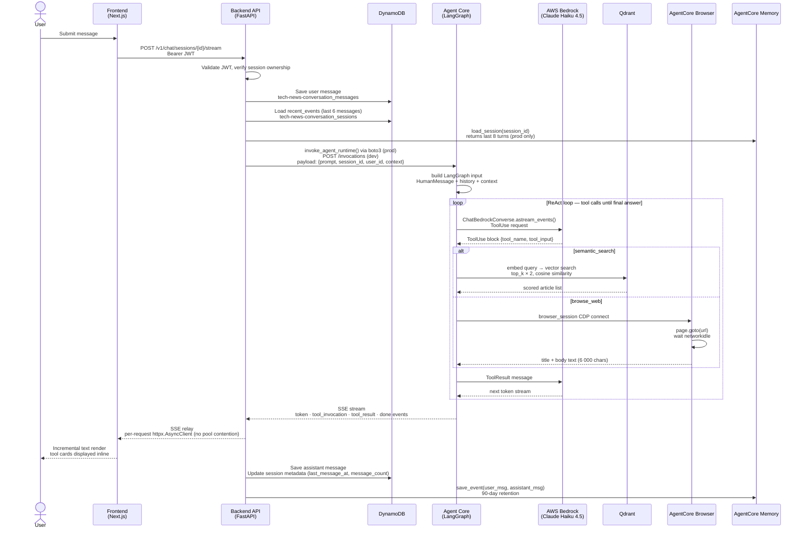
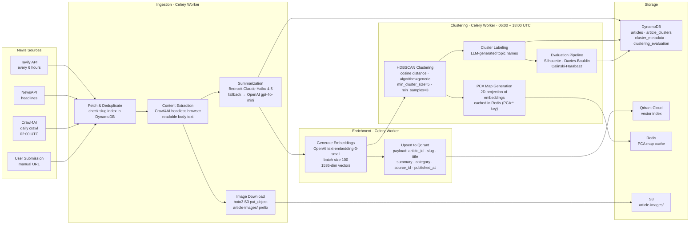
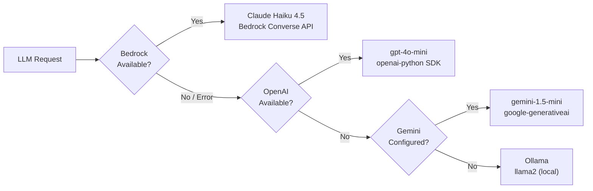

# System Architecture

> Technical reference for solution architects and engineers. Covers all components, technology choices, data stores, and request flows. Treat this as the source of truth for the logical design of the system.

---

## 1. High-Level System Overview

The system is composed of five runtime services, four data stores, and four categories of external integrations.


```mermaid
graph TB
    subgraph Client["Client"]
        U["👤 End User — Web Browser"]
    end

    subgraph AppTier["Application Tier"]
        FE["Frontend\nNext.js 14 · React 18 · TypeScript\nTailwind CSS · Zustand · React Query\nPort 3000"]
        API["Backend API\nFastAPI · Python 3.11 · Uvicorn ASGI\n19 REST + SSE endpoints  ·  /v1/*\nPort 8000"]
        AC["Agent Core\nLangGraph ReAct Agent\nBedrockAgentCoreApp · Port 8080\nModel: Claude Haiku 4.5 (Bedrock)"]
    end

    subgraph WorkerTier["Worker Tier"]
        CW["Celery Worker\n11 task modules · Python 3.11\nPlaywright · Crawl4AI · boto3"]
        CB["Celery Beat\nCron-based task scheduler\n5 recurring schedules"]
    end

    subgraph DataTier["Data Stores"]
        DDB["AWS DynamoDB\n18 tables · PAY_PER_REQUEST\nPITR on critical tables"]
        REDIS["Redis 7.1\nDB 0 — cache + sessions\nDB 1 — Celery broker\nDB 2 — Celery results"]
        QDR["Qdrant Cloud\ncollection: articles\n1536-dim OpenAI embeddings\nCosine similarity"]
        S3["AWS S3\ntech-news-articles-381492273521\nAES-256 · versioning enabled\n24-hour presigned URLs"]
    end

    subgraph BedrockTier["AWS Bedrock  ·  us-west-2"]
        CLA["Claude Haiku 4.5\nus.anthropic.claude-haiku-4-5-20251001-v1:0\nConverse API · streaming enabled"]
        ACM["AgentCore Memory\nCross-session long-term memory\n90-day event retention"]
        ACB["AgentCore Browser\nManaged Chrome · Playwright/CDP\ntool ID: tech_news_mystery_prod_browser"]
        ACCX["AgentCore Code Interpreter\nManaged Python 3.x sandbox\nArtifact download support"]
    end

    subgraph ExternalTier["External Services"]
        OAI["OpenAI API\ntext-embedding-3-small — embeddings\ngpt-4o-mini — LLM fallback"]
        TAV["Tavily Search API\nArticle discovery · 6-hour schedule"]
        NAPI["NewsAPI\nHeadline ingestion · on-demand + scheduled"]
        LFU["Langfuse  ·  cloud.langfuse.com\nLLM observability — traces · spans · scores"]
        DDG["DuckDuckGo HTML\nhtml.duckduckgo.com/html/?q=\nWeb search fallback for Agent"]
        SMTP["Email Service\nWeekly digest delivery"]
    end

    %% ── User ──────────────────────────────────────────────
    U -->|"HTTPS"| FE

    %% ── Frontend → Backend ────────────────────────────────
    FE -->|"REST  /v1/articles  /v1/search\n/v1/clusters  /v1/auth  /v1/user"| API
    FE -->|"SSE  /v1/chat/sessions/{id}/stream"| API

    %% ── Backend → Agent Core ──────────────────────────────
    API -->|"prod: boto3 invoke_agent_runtime\ndev:  HTTP POST /invocations\nSSE event stream back"| AC

    %% ── Backend → Data Stores ─────────────────────────────
    API <-->|"boto3 DynamoDB SDK\nCRUD · conditional writes"| DDB
    API <-->|"aioredis  ·  cache + sessions"| REDIS
    API <-->|"qdrant-client  ·  dense search + keyword merge"| QDR
    API -->|"boto3 S3  ·  generate_presigned_url"| S3

    %% ── Backend → LLM fallback ────────────────────────────
    API -->|"openai-python  ·  gpt-4o-mini\n(LLM provider fallback chain)"| OAI

    %% ── Agent Core ────────────────────────────────────────
    AC <-->|"Converse API  ·  streaming tokens\nToolUse / ToolResult messages"| CLA
    AC <-->|"MemoryClient.load_session\nMemoryClient.save_event"| ACM
    AC -->|"browser_session CDP\nbrowse_web tool"| ACB
    AC -->|"code_session executeCode\nexecute_code tool"| ACCX
    AC <-->|"qdrant-client\nsemantic_search tool"| QDR
    ACB -->|"Playwright page.goto()\nDDG HTML results page"| DDG

    %% ── Worker Tier ───────────────────────────────────────
    CB -->|"enqueue periodic tasks\nRedis DB 1"| REDIS
    CW <-->|"task queue · result store\nRedis DB 1 / DB 2"| REDIS
    CW <-->|"read articles  ·  write clusters\nwrite embeddings  ·  write evaluations"| DDB
    CW <-->|"upsert vectors\nbatch similarity search"| QDR
    CW -->|"article-images/*\nboto3 put_object"| S3
    CW -->|"text-embedding-3-small\nbatch of 100"| OAI
    CW -->|"article discovery\nsearch + extract"| TAV
    CW -->|"headline fetch\ntop-headlines endpoint"| NAPI
    CW -->|"weekly digest HTML\nSMTP delivery"| SMTP

    %% ── Observability ─────────────────────────────────────
    AC -->|"LangfuseCallbackHandler\ntraces · tool spans · token counts"| LFU
    API -->|"trace chat sessions\nembedding latency"| LFU
```

---

## 2. Service Responsibilities

### 2.1 Frontend  (`frontend/`)
| Property | Value |
|---|---|
| Framework | Next.js 14 (App Router) |
| Language | TypeScript 5.7 |
| Styling | Tailwind CSS 3.4 — Liquid Glass design system |
| State | Zustand 5 (global), TanStack React Query 5 (server state) |
| HTTP | Axios 1.7 |
| Animation | Framer Motion 11 |
| Build target | `node:22-alpine` Docker image |

**Key pages and experiences:**

| Page | Description |
|---|---|
| `/` Home | Recent articles feed with filtering and sorting |
| `/discover` | Full article discovery with semantic search |
| `/topics` | Cluster overview with PCA scatter map |
| `/topics/[slug]` | Cluster detail — article list |
| `/chat` | Streaming chat interface — session list + message thread |
| `/admin` | Clustering config, trigger, evaluation history |

---

### 2.2 Backend API  (`backend/app/`)
| Property | Value |
|---|---|
| Framework | FastAPI 0.136+ · Python 3.11 |
| Server | Uvicorn ASGI · Port 8000 |
| Auth | JWT (HS256) · 24h access token · 30d refresh token |
| Middleware | CORS · request ID injection · structured logging |
| Health | `GET /health` · `/health/celery` · `/health/llm` · `/health/agent-core` |

**API surface  (`/v1/`):**

| Route group | Endpoints | Notes |
|---|---|---|
| `/auth` | register · login · refresh · logout | JWT issue + revoke |
| `/articles` | list · get · filter · like · save | Paginated, DynamoDB-backed |
| `/search` | `GET /search` — hybrid (dense cosine 0.6 + keyword scoring 0.4); falls back to DynamoDB keyword scan when Qdrant unavailable · `POST /search/hybrid` (admin) — same with configurable weights · `GET /search/qdrant/stats` (admin) | Qdrant dense vectors + in-process keyword merge |
| `/sources` | list · create · toggle | News source management |
| `/user` | profile · preferences | Per-user settings |
| `/comments` | list · create · delete | Article discussions |
| `/trending` | list | Recalculated every 30 min |
| `/clusters` | list · get · pca-map | Topic groupings |
| `/chat/sessions` | create · list | Chat session management |
| `/chat/sessions/{id}/messages` | list | Persisted message history |
| `/chat/sessions/{id}/stream` | SSE stream | Live agent response |
| `/admin/clustering` | config · trigger · evaluations | Admin-only |
| `/digest` | trigger | Email digest |

---

### 2.3 Agent Core  (`agent_core/`)
| Property | Value |
|---|---|
| Framework | BedrockAgentCoreApp · Port 8080 |
| Agent | LangGraph `create_react_agent` · ReAct pattern |
| LLM | Claude Haiku 4.5 via `ChatBedrockConverse` |
| Streaming | `astream_events` → SSE → Backend → Frontend |
| Observability | Langfuse `LangfuseCallbackHandler` |

**Agent decision logic (system prompt):**

1. Always call `semantic_search` first for news/trend questions.
2. If result is empty or fewer than 2 articles → call `browse_web` with DuckDuckGo HTML.
3. For specific URLs provided by user → call `browse_web` directly.
4. For calculations or data processing → call `execute_code`.

**Tools:**

| Tool | Backed by | Input | Output |
|---|---|---|---|
| `semantic_search` | Qdrant vector DB | `query`, `top_k` | Ranked article list with title, summary, URL, score |
| `browse_web` | AgentCore Browser (Playwright/CDP) | `url`, `task` | Page title + extracted body text (6 000 char cap) |
| `execute_code` | AgentCore Code Interpreter | `code`, `language` | stdout, stderr, exit code, downloaded artifacts |

**Circuit breaker** (backend-side):  threshold 5 failures · 30-second recovery · state exposed at `GET /health/agent-core`.

**Memory:**
- **Short-term (local dev):** Last 6 `recent_events` passed from DynamoDB via request context.
- **Long-term (production):** AWS AgentCore Memory — last 8 turns loaded per session, each completed exchange saved with 90-day TTL.

---

### 2.4 Celery Worker  (`backend/app/workers/`)

**Task modules and schedules:**

| Task | Trigger | Description |
|---|---|---|
| `daily_crawl_task` | 02:00 UTC daily | Crawl4AI browser-based article extraction |
| `recalculate_trending_task` | Every 30 minutes | Recompute trending score for recent articles |
| `fetch_tavily_articles` | Every 6 hours (00 06 12 18) | Tavily article discovery and ingestion |
| `newsapi_task` | On-demand | NewsAPI headline ingestion |
| `embedding_task` | After ingestion | OpenAI `text-embedding-3-small` batch (100/call) |
| `cluster_articles` | 06:00 + 18:00 UTC | HDBSCAN clustering run |
| `generate_cluster_pca_map` | On demand (cache miss) | PCA projection to 2D for visualization |
| `evaluation_pipeline` | After clustering | Silhouette · Davies-Bouldin · Calinski-Harabasz |
| `summary_task` | After ingestion | Bedrock/OpenAI article summarization |
| `digest_task` | Weekly schedule | HTML email digest via SMTP |
| `submission_task` | On user submit | User-submitted article validation and ingestion |

---

### 2.5 Data Stores

#### AWS DynamoDB (18 tables, prefix `tech-news-`)

| Table | PK | Key Indexes | TTL |
|---|---|---|---|
| `articles` | `article_id` | `slug-index` · `source-date-index` | — |
| `users` | `user_id` | `username-index` | — |
| `comments` | `comment_id` | `article-date-index` | — |
| `user_saves` | `user_id` | `article-date-index` | — |
| `user_likes` | `user_id` | `article-date-index` | — |
| `user_preferences` | `user_id` | — | — |
| `news_sources` | `source_id` | — | — |
| `pending-searches` | `search_id` | — | — |
| `trending_articles` | `trending_id` | `date-index` | — |
| `submissions` | `submission_id` | `user-date-index` | — |
| `conversation_sessions` | `session_id` | `user-date-index` | 90 days |
| `conversation_messages` | `message_id` | `session-date-index` | 90 days |
| `chat_user_preferences` | `user_id` | — | — |
| `article_clusters` | `cluster_id` | `article-index` | 7 days |
| `cluster_metadata` | `cluster_id` | — | 7 days |
| `article_embeddings` | `article_id` | — | 7 days |
| `clustering_evaluation` | `eval_id` | `date-index` | 30 days |
| `clustering_params` | `config_id` | — | — |

#### Redis  (3 logical databases)

| DB | Purpose | Keys |
|---|---|---|
| 0 | Application cache — PCA maps · trending · search results · user sessions | `pca:*` · `trending:*` · `cache:*` |
| 1 | Celery broker — task queue and routing | Celery internal format |
| 2 | Celery result backend — task status and return values | Celery internal format |

#### Qdrant Cloud

| Property | Value |
|---|---|
| Collection | `articles` |
| Vector type | Dense only — 1 536-dim (OpenAI `text-embedding-3-small`) |
| Distance metric | Cosine similarity |
| Payload stored | `article_id` · `slug` · `title` · `summary` · `content` (first 1 000 chars) · `category` · `author` · `source_id` · `published_at` · `view_count` |
| Dense search | `query_points` with cosine similarity — top-k × 2 over-fetch, filtered by `min_score` |
| Keyword scoring | Manual: `client.scroll()` retrieves all points; Python scores each by title/summary keyword frequency; merged with dense scores at runtime |
| Hybrid merge | `hybrid_score = dense_score × 0.6 + keyword_score_normalised × 0.4` (weights configurable via `/search/hybrid`) |
| Fallback | When Qdrant unavailable: `SearchService` does a full DynamoDB scan + in-process title/content/summary scoring |

#### AWS S3

| Property | Value |
|---|---|
| Bucket | `tech-news-articles-381492273521` |
| Prefix | `article-images/` |
| Encryption | AES-256 server-side |
| Access | All public access blocked — 24-hour presigned URLs |
| Versioning | Enabled · noncurrent versions expire after 30 days |

---

## 3. Chat Streaming Request Flow


```mermaid
sequenceDiagram
    actor User
    participant FE as Frontend<br/>(Next.js)
    participant API as Backend API<br/>(FastAPI)
    participant DDB as DynamoDB
    participant AC as Agent Core<br/>(LangGraph)
    participant BED as AWS Bedrock<br/>(Claude Haiku 4.5)
    participant QDR as Qdrant
    participant ACB as AgentCore Browser
    participant MEM as AgentCore Memory

    User->>FE: Submit message
    FE->>API: POST /v1/chat/sessions/{id}/stream<br/>Bearer JWT
    API->>API: Validate JWT, verify session ownership
    API->>DDB: Save user message<br/>tech-news-conversation_messages
    API->>DDB: Load recent_events (last 6 messages)<br/>tech-news-conversation_sessions

    API->>MEM: load_session(session_id)<br/>returns last 8 turns (prod only)

    API->>AC: invoke_agent_runtime() via boto3 (prod)<br/>POST /invocations (dev)<br/>payload: {prompt, session_id, user_id, context}

    AC->>AC: build LangGraph input<br/>HumanMessage + history + context

    loop ReAct loop — tool calls until final answer
        AC->>BED: ChatBedrockConverse.astream_events()<br/>ToolUse request
        BED-->>AC: ToolUse block {tool_name, tool_input}

        alt semantic_search
            AC->>QDR: embed query → vector search<br/>top_k × 2, cosine similarity
            QDR-->>AC: scored article list
        else browse_web
            AC->>ACB: browser_session CDP connect
            ACB->>ACB: page.goto(url)<br/>wait networkidle
            ACB-->>AC: title + body text (6 000 chars)
        end

        AC->>BED: ToolResult message
        BED-->>AC: next token stream
    end

    AC-->>API: SSE stream<br/>token · tool_invocation · tool_result · done events
    API-->>FE: SSE relay<br/>per-request httpx.AsyncClient (no pool contention)
    FE-->>User: Incremental text render<br/>tool cards displayed inline

    API->>DDB: Save assistant message<br/>Update session metadata (last_message_at, message_count)
    API->>MEM: save_event(user_msg, assistant_msg)<br/>90-day retention
```

---

## 4. Article Ingestion Pipeline


```mermaid
graph LR
    subgraph Sources["News Sources"]
        TAV["Tavily API\nevery 6 hours"]
        NAPI["NewsAPI\nheadlines"]
        CRAWL["Crawl4AI\ndaily crawl\n02:00 UTC"]
        USUB["User Submission\nmanual URL"]
    end

    subgraph Ingestion["Ingestion  ·  Celery Worker"]
        FETCH["Fetch & Deduplicate\ncheck slug index in DynamoDB"]
        SCRAPE["Content Extraction\nCrawl4AI headless browser\nreadable body text"]
        SUMM["Summarization\nBedrock Claude Haiku 4.5\nfallback → OpenAI gpt-4o-mini"]
        IMG["Image Download\nboto3 S3 put_object\narticle-images/ prefix"]
    end

    subgraph Enrichment["Enrichment  ·  Celery Worker"]
        EMBED["Generate Embeddings\nOpenAI text-embedding-3-small\nbatch size 100\n1536-dim vectors"]
        UPSERT["Upsert to Qdrant\npayload: article_id · slug · title\nsummary · category · source_id · published_at"]
    end

    subgraph Clustering["Clustering  ·  Celery Worker  ·  06:00 + 18:00 UTC"]
        HDBSCAN["HDBSCAN Clustering\ncosine distance · algorithm=generic\nmin_cluster_size=5 · min_samples=3"]
        LABEL["Cluster Labeling\nLLM-generated topic names"]
        EVAL["Evaluation Pipeline\nSilhouette · Davies-Bouldin\nCalinski-Harabasz"]
        PCA["PCA Map Generation\n2D projection of embeddings\ncached in Redis (PCA:* key)"]
    end

    subgraph Storage["Storage"]
        DDB2["DynamoDB\narticles · article_clusters\ncluster_metadata · clustering_evaluation"]
        QDR2["Qdrant Cloud\nvector index"]
        REDIS2["Redis\nPCA map cache"]
        S3B["S3\narticle-images/"]
    end

    TAV --> FETCH
    NAPI --> FETCH
    CRAWL --> FETCH
    USUB --> FETCH

    FETCH --> SCRAPE
    SCRAPE --> SUMM
    SCRAPE --> IMG
    IMG --> S3B

    SUMM --> DDB2
    SUMM --> EMBED
    EMBED --> UPSERT
    UPSERT --> QDR2

    EMBED --> HDBSCAN
    HDBSCAN --> LABEL
    LABEL --> EVAL
    LABEL --> DDB2
    EVAL --> DDB2
    HDBSCAN --> PCA
    PCA --> REDIS2
```

---

## 5. Clustering Quality Evaluation

After each HDBSCAN run, three quality metrics are computed and stored in `tech-news-clustering_evaluation` (30-day TTL):

| Metric | Better direction | Weight |
|---|---|---|
| Silhouette score | Higher (−1 to 1) | 0.5 |
| Davies-Bouldin index | Lower (≥ 0) | 0.3 |
| Calinski-Harabasz index | Higher (≥ 0) | 0.2 |

A composite score is computed as:
```
score = (silhouette_weight × silhouette)
      + (db_weight × (1 / (1 + davies_bouldin)))
      + (ch_weight × normalized_calinski_harabasz)
```

Runs below `CLUSTERING_QUALITY_THRESHOLD` (default `0.6`) are flagged in the admin UI.

---

## 6. LLM Provider Fallback Chain

The backend maintains a configurable fallback chain (`LLM_PROVIDER=bedrock,openai`):


```mermaid
graph LR
    REQ["LLM Request"] --> BED{"Bedrock\nAvailable?"}
    BED -->|"Yes"| B1["Claude Haiku 4.5\nBedrock Converse API"]
    BED -->|"No / Error"| OAI{"OpenAI\nAvailable?"}
    OAI -->|"Yes"| O1["gpt-4o-mini\nopenai-python SDK"]
    OAI -->|"No"| GEM{"Gemini\nConfigured?"}
    GEM -->|"Yes"| G1["gemini-1.5-mini\ngoogle-generativeai"]
    GEM -->|"No"| OLL["Ollama\nllama2 (local)"]
```

The Agent Core always uses Bedrock directly (no fallback chain in the agent).

---

## 7. Observability

| Signal | Tool | Captured by |
|---|---|---|
| LLM traces (prompts, completions, tool calls) | Langfuse | Agent Core (`LangfuseCallbackHandler`) |
| Embedding latency | Langfuse | Backend API |
| Chat session spans | Langfuse | Backend API |
| ECS task logs | AWS CloudWatch `/ecs/tech-news-prod` | All ECS tasks (30-day retention) |
| Worker memory / CPU alarms | AWS CloudWatch Alarms | Worker ECS service |
| Circuit breaker state | `GET /health/agent-core` | Backend API in-process |
| Task queue depth | Redis INFO | Celery / Beat |
