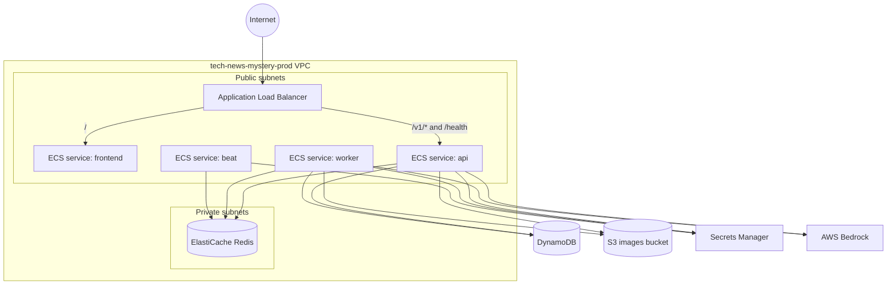
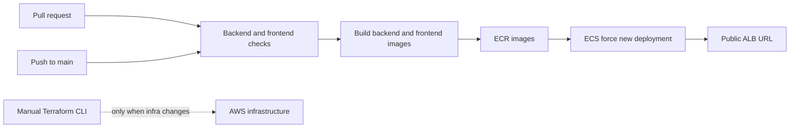
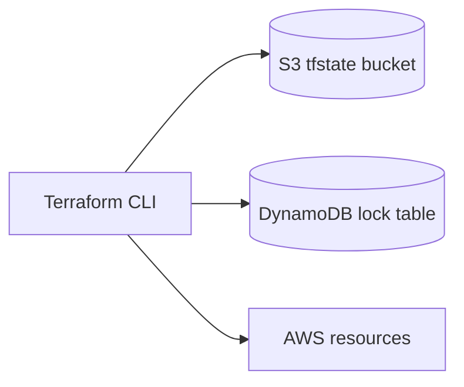

# Deployment Architecture

Production is deployed to AWS `us-west-2` with Terraform in
`infra/terraform`.

## AWS Topology



## CI/CD Flow



The active GitHub workflow is `.github/workflows/deploy.yml`. The Terraform
workflow is parked as `.github/workflows/terraform.yml.bak`, so app commits do
not automatically redeploy infrastructure.

## Terraform State



State backend resources:

| Resource | Name |
| --- | --- |
| S3 state bucket | `tech-news-mystery-tfstate-381492273521` |
| DynamoDB lock table | `tech-news-mystery-terraform-locks` |

## Existing Imported Resources

These resources existed before Terraform and are imported into state:

| Type | Name |
| --- | --- |
| S3 bucket | `tech-news-articles-381492273521` |
| DynamoDB table | `tech-news-users` |
| DynamoDB table | `tech-news-articles` |
| DynamoDB table | `tech-news-comments` |
| DynamoDB table | `tech-news-user_saves` |
| DynamoDB table | `tech-news-user_likes` |
| DynamoDB table | `tech-news-user_preferences` |
| DynamoDB table | `tech-news-news_sources` |
| DynamoDB table | `tech-news-pending-searches` |
| DynamoDB table | `tech-news-trending_articles` |
| DynamoDB table | `tech-news-submissions` |

## Operational Checks

```powershell
terraform output
aws ecs describe-services --region us-west-2 --cluster tech-news-mystery-prod --services frontend api worker beat
aws logs tail /ecs/tech-news-mystery-prod --region us-west-2 --follow
```
