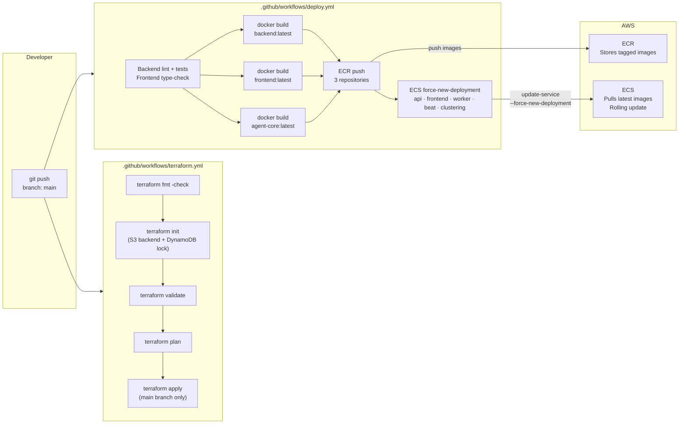
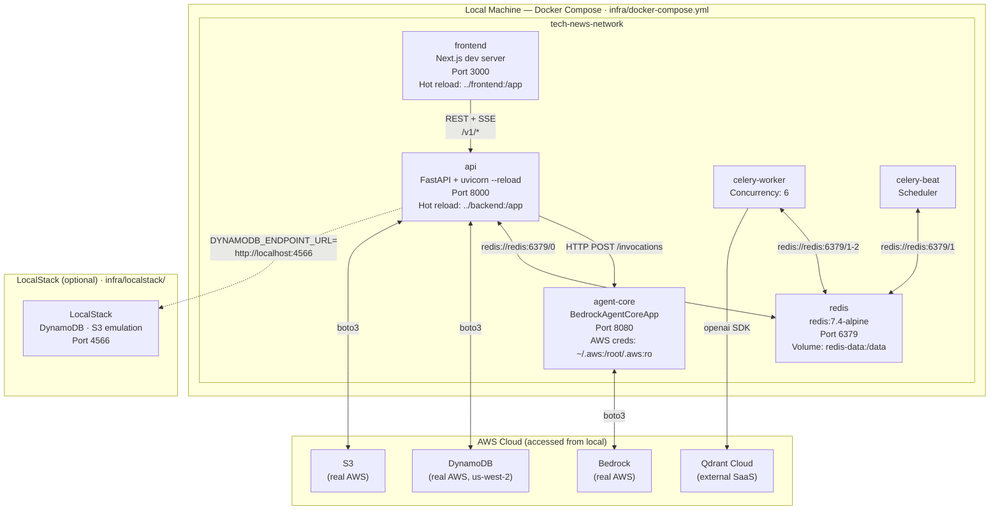

# Deployment Architecture

> Infrastructure reference for solution architects and DevOps engineers. Covers the AWS topology, network design, container configuration, CI/CD pipeline, and local development environment.

---

## 1. AWS Infrastructure Overview

```mermaid
graph TB
    subgraph Internet["Internet"]
        USER["👤 End Users"]
        GH["GitHub Actions\nCI/CD Pipeline"]
    end

    subgraph AWS["AWS  ·  Region: us-west-2"]

        subgraph ManagedServices["Managed Services  (outside VPC)"]
            DDB["AWS DynamoDB\n18 tables · PAY_PER_REQUEST\nPITR enabled · TTL on temp tables"]
            S3["AWS S3\ntech-news-articles-381492273521\nAES-256 · versioning · no public access"]
            ECR["AWS ECR\n3 repositories\nbackend · frontend · agent-core"]
            SM["AWS Secrets Manager\ntech-news-mystery-app-secret\n12 secret keys"]
            CW["AWS CloudWatch\n/ecs/tech-news-prod  30-day retention\nMemory + CPU alarms"]
            BED["AWS Bedrock\nClaude Haiku 4.5\nConverse API  ·  streaming"]
            ACM["AgentCore Memory\n90-day retention"]
            ACB["AgentCore Browser\nPlaywright/CDP managed Chrome"]
            ACCX["AgentCore Code Interpreter\nManaged Python sandbox"]
        end

        subgraph VPC["VPC  ·  10.40.0.0/16"]

            subgraph PublicSubnets["Public Subnets  ·  2 AZs"]
                PSA["10.40.0.0/24\nus-west-2a"]
                PSB["10.40.1.0/24\nus-west-2b"]
                ALB["Application Load Balancer\nHTTP 80  ·  HTTPS 443 optional\nIdle timeout: 120s\nDeregistration delay: 30s"]
            end

            subgraph ECSCluster["ECS Cluster  ·  tech-news-prod  ·  FARGATE"]

                subgraph FrontendSvc["Service: frontend\nDesired: 1  ·  1024 CPU  ·  2048 MB"]
                    FE["Task: tech-news-prod-frontend\nNext.js 14 · Node 22-alpine\nPort 3000\nHealthcheck: GET /"]
                end

                subgraph APISvc["Service: api\nDesired: 1  ·  1024 CPU  ·  2048 MB"]
                    API["Task: tech-news-prod-api\nFastAPI · python:3.11-slim\nPort 8000\nHealthcheck: GET /health"]
                end

                subgraph ACCoreSvc["Service: agent-core\nDesired: 1  ·  1024 CPU  ·  2048 MB"]
                    AC["Task: tech-news-prod-agent-core\nBedrockAgentCoreApp · python:3.11-slim\nPort 8080\nHealthcheck: GET /ping"]
                end

                subgraph WorkerSvc["Service: worker\nDesired: 1  ·  1024 CPU  ·  2048 MB"]
                    CW2["Task: tech-news-prod-worker\nCelery Worker · python:3.11-slim\nConcurrency: 6 · max tasks/child: 10"]
                end

                subgraph BeatSvc["Service: beat\nDesired: 1  ·  256 CPU  ·  512 MB"]
                    CB["Task: tech-news-prod-beat\nCelery Beat Scheduler\npython:3.11-slim"]
                end

                subgraph ClusteringSvc["Service: clustering\nDesired: 1  ·  2048 CPU  ·  4096 MB"]
                    CLU["Task: tech-news-prod-clustering\nHDBSCAN + PCA + Evaluation\npython:3.11-slim"]
                end

            end

            subgraph PrivateSubnets["Private Subnets  ·  2 AZs"]
                PVSA["10.40.10.0/24\nus-west-2a"]
                PVSB["10.40.11.0/24\nus-west-2b"]
                REDIS["AWS ElastiCache Redis 7.1\ncache.t4g.micro  ·  single node\nPort 6379\nEncryption at rest: enabled"]
            end

        end

        subgraph ExternalVectorDB["External Vector DB"]
            QDR["Qdrant Cloud\ncollection: articles\n1536-dim · Cosine similarity"]
        end

    end

    subgraph ExternalSaaS["External SaaS"]
        OAI["OpenAI API\nembeddings + LLM fallback"]
        TAV["Tavily Search API"]
        NAPI["NewsAPI"]
        LFU["Langfuse  ·  cloud.langfuse.com\nLLM observability"]
    end

    %% ── Internet ──────────────────────────────────────────
    USER -->|"HTTPS 443 / HTTP 80"| ALB
    GH -->|"docker push\nboto3 ECR.put_image"| ECR
    GH -->|"terraform apply\nboto3 ECS.update_service"| AWS

    %% ── ALB routing ───────────────────────────────────────
    ALB -->|"/v1/*  →  Port 8000"| API
    ALB -->|"/*   →  Port 3000"| FE

    %% ── Service communication ─────────────────────────────
    API -->|"SSE stream\nboto3 invoke_agent_runtime\nor HTTP POST /invocations"| AC
    API <-->|"boto3 DynamoDB SDK"| DDB
    API <-->|"aioredis  DB 0"| REDIS
    API <-->|"qdrant-client"| QDR
    API -->|"boto3 S3"| S3
    API -->|"GetSecretValue"| SM
    AC  -->|"GetSecretValue"| SM

    %% ── Agent Core ────────────────────────────────────────
    AC <-->|"Converse API streaming"| BED
    AC <-->|"MemoryClient"| ACM
    AC -->|"browser_session CDP"| ACB
    AC -->|"code_session"| ACCX
    AC <-->|"qdrant-client"| QDR

    %% ── Workers ───────────────────────────────────────────
    CW2 <-->|"Celery broker  DB 1"| REDIS
    CB  <-->|"Celery scheduler  DB 1"| REDIS
    CLU <-->|"Celery broker  DB 1"| REDIS
    CW2 <-->|"boto3 DynamoDB"| DDB
    CW2 <-->|"qdrant-client"| QDR
    CW2 -->|"boto3 S3"| S3

    %% ── External APIs ─────────────────────────────────────
    CW2 -->|"embedding batch"| OAI
    CW2 -->|"article discovery"| TAV
    CW2 -->|"headline fetch"| NAPI
    AC  -->|"LangfuseCallbackHandler"| LFU
    API -->|"trace spans"| LFU

    %% ── ECR pull ──────────────────────────────────────────
    FE  -.->|"pull image"| ECR
    API -.->|"pull image"| ECR
    AC  -.->|"pull image"| ECR
    CW2 -.->|"pull image"| ECR

    %% ── CloudWatch ────────────────────────────────────────
    FE  -.->|"awslogs driver"| CW
    API -.->|"awslogs driver"| CW
    AC  -.->|"awslogs driver"| CW
    CW2 -.->|"awslogs driver"| CW
```

---

## 2. Network & Security Topology

### 2.1 VPC Layout

| Layer | CIDR | Resources | Notes |
|---|---|---|---|
| VPC | `10.40.0.0/16` | All VPC resources | 2 AZs for ALB requirement |
| Public Subnet AZ-A | `10.40.0.0/24` | ALB · ECS tasks | Internet-routable |
| Public Subnet AZ-B | `10.40.1.0/24` | ALB second node | Internet-routable |
| Private Subnet AZ-A | `10.40.10.0/24` | ElastiCache primary | No direct internet access |
| Private Subnet AZ-B | `10.40.11.0/24` | ElastiCache secondary | No direct internet access |

> **Note:** ECS Fargate tasks run in public subnets with `assignPublicIp: ENABLED` for outbound internet access (no NAT Gateway cost). All inbound traffic passes through the ALB.

### 2.2 Security Groups

| Security Group | Inbound | Outbound | Applied to |
|---|---|---|---|
| `alb-sg` | TCP 80 from `0.0.0.0/0` TCP 443 from `0.0.0.0/0` | All traffic | ALB |
| `ecs-sg` | TCP 8000 from `alb-sg` TCP 3000 from `alb-sg` | All traffic | All ECS tasks |
| `redis-sg` | TCP 6379 from `ecs-sg` | All traffic | ElastiCache |

### 2.3 IAM Roles

| Role | Used by | Key permissions |
|---|---|---|
| `tech-news-prod-ecs-task-execution` | ECS task execution | `ecr:GetAuthorizationToken` · `ecr:BatchGetImage` · `logs:CreateLogStream` · `secretsmanager:GetSecretValue` |
| `tech-news-prod-ecs-task` | Running ECS containers | `dynamodb:*` · `s3:*` · `bedrock:InvokeModel` · `bedrock:InvokeModelWithResponseStream` · `bedrock-agentcore:*` · `secretsmanager:GetSecretValue` |
| `tech-news-prod-agentcore-runtime` | AgentCore runtime | `bedrock:InvokeModel` · `bedrock-agentcore:*` · `secretsmanager:GetSecretValue` |

---

## 3. ECS Service Configuration

| Service | Task definition | Docker image | Port | CPU | Memory | Healthcheck |
|---|---|---|---|---|---|---|
| `frontend` | `tech-news-prod-frontend` | `{ECR}/tech-news-prod-frontend:latest` | 3000 | 1024 | 2048 MB | `GET /` (200–399) |
| `api` | `tech-news-prod-api` | `{ECR}/tech-news-prod-backend:latest` | 8000 | 1024 | 2048 MB | `GET /health` (200–399) |
| `agent-core` | `tech-news-prod-agent-core` | `{ECR}/tech-news-prod-agent-core:latest` | 8080 | 1024 | 2048 MB | `GET /ping` (200–399) |
| `worker` | `tech-news-prod-worker` | `{ECR}/tech-news-prod-backend:latest` | — | 1024 | 2048 MB | — |
| `beat` | `tech-news-prod-beat` | `{ECR}/tech-news-prod-backend:latest` | — | 256 | 512 MB | — |
| `clustering` | `tech-news-prod-clustering` | `{ECR}/tech-news-prod-backend:latest` | — | 2048 | 4096 MB | — |

**ECR Repositories:**

| Repository | Account | Region |
|---|---|---|
| `tech-news-prod-backend` | `381492273521` | `us-west-2` |
| `tech-news-prod-frontend` | `381492273521` | `us-west-2` |
| `tech-news-prod-agent-core` | `381492273521` | `us-west-2` |

---

## 4. Managed AWS Services

### 4.1 DynamoDB

| Property | Value |
|---|---|
| Billing | PAY_PER_REQUEST (on-demand) |
| Table prefix | `tech-news-` |
| Total tables | 18 |
| PITR | Enabled on all 18 tables |
| Encryption | AWS-managed keys (default) |

### 4.2 ElastiCache Redis

| Property | Value |
|---|---|
| Engine version | Redis 7.1 |
| Node type | `cache.t4g.micro` |
| Cluster mode | Disabled (single node) |
| Multi-AZ | Disabled |
| Automatic failover | Disabled |
| Encryption at rest | Enabled |
| Encryption in transit | Disabled |
| Port | 6379 |

### 4.3 S3

| Property | Value |
|---|---|
| Bucket | `tech-news-articles-381492273521` |
| Region | `us-west-2` |
| Versioning | Enabled |
| Encryption | AES-256 (SSE-S3) |
| Public access | Fully blocked |
| Object access | 24-hour presigned URLs only |
| Lifecycle | Expire noncurrent versions after 30 days |

### 4.4 AWS Bedrock AgentCore Resources

| Resource | Type | ID |
|---|---|---|
| Agent Runtime | `bedrock-agentcore:agent-runtime` | Set via `AGENT_CORE_RUNTIME_ARN` env var |
| Memory | `bedrock-agentcore:memory` | Set via `MEMORY_ID` env var · 90-day event TTL |
| Browser | `bedrock-agentcore:browser` | Dynamically generated by Terraform · set via `BROWSER_ID` env var |
| Code Interpreter | `bedrock-agentcore:code-interpreter` | Set via `CODE_INTERPRETER_ID` env var |

### 4.5 Secrets Manager

**Secret name:** `tech-news-mystery-prod/app`

| Key | Purpose |
|---|---|
| `SECRET_KEY` | FastAPI session secret |
| `JWT_SECRET_KEY` | JWT token signing |
| `OPENAI_API_KEY` | Embeddings + LLM fallback |
| `TAVILY_API_KEY` | Article discovery |
| `NEWSAPI_KEY` | Headline ingestion |
| `QDRANT_URL` | Qdrant Cloud endpoint |
| `QDRANT_API_KEY` | Qdrant Cloud auth |
| `GEMINI_API_KEY` | Gemini LLM fallback |
| `ANTHROPIC_API_KEY` | Legacy Anthropic direct |
| `LANGFUSE_SECRET_KEY` | Langfuse API secret |
| `LANGFUSE_PUBLIC_KEY` | Langfuse public key |
| `LANGFUSE_BASE_URL` | Langfuse endpoint (default: `https://cloud.langfuse.com`) |

---

## 5. CI/CD Pipeline

```mermaid
graph LR
    subgraph Dev["Developer"]
        CODE["git push\nbranch: main"]
    end

    subgraph TerraformPipeline[".github/workflows/terraform.yml"]
        TF1["terraform fmt -check"]
        TF2["terraform init\n(S3 backend + DynamoDB lock)"]
        TF3["terraform validate"]
        TF4["terraform plan"]
        TF5["terraform apply\n(main branch only)"]
        TF1 --> TF2 --> TF3 --> TF4 --> TF5
    end

    subgraph AppPipeline[".github/workflows/deploy.yml"]
        LINT["Backend lint + tests\nFrontend type-check"]
        BUILD1["docker build\nbackend:latest"]
        BUILD2["docker build\nfrontend:latest"]
        BUILD3["docker build\nagent-core:latest"]
        PUSH["ECR push\n3 repositories"]
        DEPLOY["ECS force-new-deployment\napi · frontend · worker · beat · clustering"]
        LINT --> BUILD1 & BUILD2 & BUILD3
        BUILD1 & BUILD2 & BUILD3 --> PUSH
        PUSH --> DEPLOY
    end

    CODE --> TerraformPipeline
    CODE --> AppPipeline

    subgraph AWSCI["AWS"]
        ECR2["ECR\nStores tagged images"]
        ECS2["ECS\nPulls latest images\nRolling update"]
    end

    PUSH -->|"push images"| ECR2
    DEPLOY -->|"update-service\n--force-new-deployment"| ECS2
```

**Required GitHub Secrets / Variables:**

| Name | Type | Purpose |
|---|---|---|
| `AWS_ROLE_TO_ASSUME` | Secret | IAM role ARN for OIDC assume-role |
| `TF_STATE_BUCKET` | Secret | S3 bucket for Terraform remote state |
| `TF_STATE_LOCK_TABLE` | Secret | DynamoDB table for Terraform state locking |
| `AWS_REGION` | Variable | Default: `us-west-2` |
| `ECS_CLUSTER` | Variable | ECS cluster name |
| `BACKEND_ECR_REPOSITORY` | Variable | Backend ECR repository URI |
| `FRONTEND_ECR_REPOSITORY` | Variable | Frontend ECR repository URI |
| `AGENT_CORE_ECR_REPOSITORY` | Variable | Agent Core ECR repository URI |

---

## 6. Local Development Environment

```mermaid
graph TB
    subgraph LocalDev["Local Machine — Docker Compose  ·  infra/docker-compose.yml"]

        subgraph DockerNetwork["tech-news-network"]
            FE_L["frontend\nNext.js dev server\nPort 3000\nHot reload: ../frontend:/app"]
            API_L["api\nFastAPI + uvicorn --reload\nPort 8000\nHot reload: ../backend:/app"]
            AC_L["agent-core\nBedrockAgentCoreApp\nPort 8080\nAWS creds: ~/.aws:/root/.aws:ro"]
            W_L["celery-worker\nConcurrency: 6"]
            B_L["celery-beat\nScheduler"]
            REDIS_L["redis\nredis:7.4-alpine\nPort 6379\nVolume: redis-data:/data"]
        end

    end

    subgraph AWSCloud["AWS Cloud  (accessed from local)"]
        DDB_L["DynamoDB\n(real AWS, us-west-2)"]
        S3_L["S3\n(real AWS)"]
        BED_L["Bedrock\n(real AWS)"]
        QDR_L["Qdrant Cloud\n(external SaaS)"]
    end

    subgraph LocalStack["LocalStack  (optional)  ·  infra/localstack/"]
        LS["LocalStack\nDynamoDB · S3 emulation\nPort 4566"]
    end

    FE_L -->|"REST + SSE\n/v1/*"| API_L
    API_L -->|"HTTP POST /invocations"| AC_L
    API_L <-->|"redis://redis:6379/0"| REDIS_L
    W_L  <-->|"redis://redis:6379/1-2"| REDIS_L
    B_L  <-->|"redis://redis:6379/1"| REDIS_L

    API_L <-->|"boto3"| DDB_L
    API_L <-->|"boto3"| S3_L
    AC_L  <-->|"boto3"| BED_L
    W_L  -->|"openai SDK"| QDR_L

    API_L -.->|"DYNAMODB_ENDPOINT_URL=\nhttp://localhost:4566"| LS
```

**Local service URLs:**

| Service | URL | Notes |
|---|---|---|
| Frontend | `http://localhost:3000` | Next.js dev server with HMR |
| Backend API | `http://localhost:8000` | Auto-reload on file save |
| Swagger UI | `http://localhost:8000/docs` | Interactive API docs |
| ReDoc | `http://localhost:8000/redoc` | Alternative API docs |
| Agent Core | `http://localhost:8080` | |
| Agent Core health | `http://localhost:8080/ping` | |
| Redis | `localhost:6379` | |

**Docker images (local):**

| Service | Base image | Dockerfile |
|---|---|---|
| `api` | `python:3.11-slim` | `infra/docker/backend.Dockerfile` |
| `agent-core` | `python:3.11-slim` | `infra/docker/agent-core.Dockerfile` |
| `celery-worker` | `python:3.11-slim` | `infra/docker/celery.Dockerfile` |
| `frontend` | `node:22-alpine` | `frontend/Dockerfile.dev` |
| `redis` | `redis:7.4-alpine` | Official |

---

## 7. Environment Comparison

| Aspect | Local Dev | Production (AWS) |
|---|---|---|
| Frontend | `npm run dev` (port 3000) | ECS Fargate · via ALB |
| Backend API | `uvicorn --reload` (port 8000) | ECS Fargate · via ALB `/v1/*` |
| Agent Core | HTTP POST `/invocations` (port 8080) | `boto3 invoke_agent_runtime` · AgentCore Runtime ARN |
| Redis | Docker container | AWS ElastiCache `cache.t4g.micro` |
| DynamoDB | Real AWS / LocalStack | Real AWS · `us-west-2` |
| S3 | Real AWS | Real AWS |
| Bedrock | Real AWS | Real AWS |
| Qdrant | Cloud (or local Docker) | Qdrant Cloud |
| Secrets | `.env` file | AWS Secrets Manager |
| Logs | stdout / file | CloudWatch `/ecs/tech-news-prod` |
| Scaling | Single process | ECS desired count + task CPU/memory |
| TLS | None | ALB HTTPS listener (ACM certificate) |
| Auth to AWS | `~/.aws/credentials` | ECS task IAM role (no credentials in env) |
